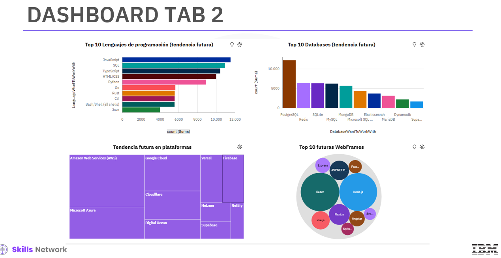
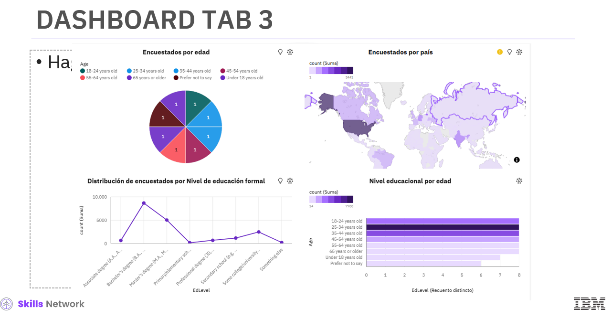

# IBM Data Analyst Capstone Project 📊

**Autor:** Italo López  
**Fecha:** Diciembre 2025

## Resumen
Este proyecto finaliza el curso de IBM Data Analyst. El objetivo principal fue analizar las tendencias tecnológicas actuales y futuras en la industria del desarrollo de software, utilizando datos de la encuesta anual de Stack Overflow (aprox. 90.000 participantes).

El análisis busca identificar hacia dónde se mueven los desarrolladores y caracterizar la fuerza laboral tecnológica global.

## Tecnologías y Herramientas
El proyecto implementó un flujo de trabajo completo de análisis de datos utilizando **Python**:
* **Recolección de datos:** Web Scraping y consumo de APIs (biblioteca `requests`).
* **Procesamiento:** Limpieza y estructuración de datos (Data Wrangling).
* **Análisis:** Exploración estadística (distribución, detección de outliers y correlaciones).
* **Visualización:** Creación de gráficos comparativos y Dashboards interactivos.

## Metodología
La metodología se dividió en las siguientes fases:
1.  **Recopilación:** Obtención del dataset crudo mediante APIs y scraping.
2.  **Limpieza:** Estandarización de datos para asegurar calidad.
3.  **Análisis Exploratorio:** Identificación de patrones iniciales.
4.  **Visualización:** Comunicación de resultados clave mediante gráficos y tableros de control.

## Hallazgos Clave

### 1. Tendencias en Lenguajes de Programación
* **Dominio Actual:** JavaScript mantiene su liderazgo indiscutible en la industria.
* **Crecimiento:** Python continúa siendo el lenguaje con crecimiento más rápido, impulsado por la ciencia de datos.
* **El Ascenso de TypeScript:** Se observa una migración probable de JavaScript hacia TypeScript, que gana popularidad acelerada por su robustez y seguridad en entornos corporativos.

### 2. Tendencias en Bases de Datos
* **Líderes de Mercado:** MySQL lidera ampliamente el uso actual.
* **Expansión Open-Source:** PostgreSQL y MongoDB están en clara expansión, desplazando a bases de datos tradicionales propietarias como SQL Server y Oracle.
* **Modernización:** Existe una preferencia marcada del mercado por soluciones Open-Source y NoSQL para aplicaciones modernas.

### 3. Demografía
* La demografía tecnológica sigue siendo homogénea, con predominancia de desarrolladores jóvenes y masculinos, evidenciando desafíos en diversidad geográfica y educativa.

## Visualizaciones y Dashboards

### 🔹 Panorama Actual
Visualización de los lenguajes, bases de datos y marcos de trabajo más utilizados actualmente por los desarrolladores.

### 🔹 Tendencias Futuras
Proyección de las tecnologías que los desarrolladores desean aprender y adoptar en el próximo año.

### 🔹 Demografía de los Encuestados
Desglose demográfico incluyendo edad, ubicación geográfica y nivel educativo de los participantes.

## Conclusión
El análisis confirma que las tendencias tecnológicas son predecibles. La industria avanza hacia herramientas abiertas y escalables (TypeScript, PostgreSQL), presentando oportunidades clave para desarrolladores que se formen en estas tecnologías emergentes.

---
*Proyecto realizado como parte de la certificación IBM Data Analyst en Coursera.*
